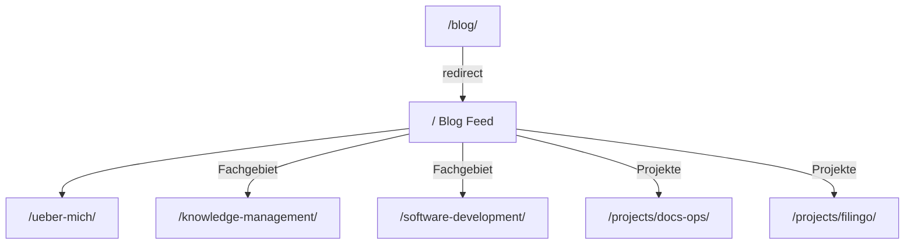

# Zielbild: Persönliche Website (Blog-first)

Stand: Juli 2026  
Branch: `prep/docs-engineering-main`  
Referenz: `ideen.md`, Fachseite aus `plan/dev-incoming/`

---

## 1. Strategisches Ziel

Persönliche Site, auf der **Gedanken zuerst sprechen** (Show, don’t tell).  
Documentation Engineering ist eine **wachsende Ausrichtung**, nicht die einzige Einstiegsbotschaft.

Nicht:

> Full-Stack-Services-Landing oder Bio-Hero „Hallo, ich heiße…“

Sondern:

> Blog-Einstieg mit eigenen Beiträgen · Person auf Über mich · Docs und Software als Fachgebiete · Projekte als Proof

Filingo-Blog (`blog.filingo.app`) ist der Blog eines **Projekts**, nicht der Site-Blog.

---

## 2. Informationsarchitektur

| URL | Rolle |
|---|---|
| `/` | Persönlicher Blog-Feed (Orientierungszeile + Beiträge) |
| `/ueber-mich/` | Person, Portrait, Werdegang |
| `/knowledge-management/` | Fach-Vertiefung Wissensmanagement (DE/EN) |
| `/software-development/` | KI-Schwerpunkt; Kapazität auf inneren Kreis; Produktdimensionen |
| `/projects/docs-ops/`, `/projects/filingo/` | Einzelprojekte (`/projects/` existiert nicht → 404) |
| `/blog/` | Redirect → `/` |



### Nicht vorgesehen

- Bio-„Hallo“-Hero auf `/`
- Filingo als Site-Blog verkaufen
- Nav-Labels „Leistungen“ / „Services“ / „Expertise“ / „Dokumentation“
- Docs-Sales-Landing als Home

### Redirects

- `/services/` → `/software-development/`
- `/software-systeme/` → `/software-development/`
- `/webentwicklung/` → `/software-development/`
- `/web-development/` → `/software-development/`
- `/blog/` → `/`
- `/documentation-engineering/` → `/knowledge-management/`
- `/wissenssysteme/` → `/knowledge-management/`
- `/wissensmanagement/` → `/knowledge-management/`

---

## 3. Navigation

```
Blog · Über mich · Fachgebiet ▾ · Projekte ▾ · Kontakt
                    ├─ Softwareentwicklung  ├─ DocsOps / Filingo …
                    └─ Wissensmanagement

EN-Nav: Fields · URLs flach (`/software-development/`, `/knowledge-management/`)
Redirects: `/documentation-engineering/`, `/wissenssysteme/`, `/wissensmanagement/` → `/knowledge-management/`

- „Blog“ führt auf `/`
- Kontakt als **Textlink**, kein Button-CTA
- Fachgebiet & Projekte: Desktop-Dropdown (Button, keine Hub-Seite), Mobile sichtbare Unterpunkte
- Keine Projekte-Übersicht `/projects/` (404); Nav und Footer verlinken DocsOps und Filingo direkt

---

## 4. Startseite `/` (Blog)

**Show, don’t tell:** Beiträge tragen die Positionierung.

Aufbau:

1. Kurze Orientierungszeile (Name + Positionszeile) — kein Lebenslauf
2. Beitragsliste (Pagination)
3. Optional Kategorien, wenn vorhanden

Docs-Themen laufen über die Blog-Serie und verlinken auf `/knowledge-management/`.

---

## 5. Über mich `/ueber-mich/`

Ruhige Fläche im Blog-Rhythmus: Portrait + Text. Keine Fachgebiete-/Kontakt-Sektionen
(dafür Nav + Footer).

**Layout:** H1 → Text links, Portrait rechts (schmalere Lesespalte).

**Struktur:** Hallo → Medien/Redaktion → Wechsel (Konflikt als Prinzip) → Langzeitprojekt
Web-App → Kooperation/Open Source → DocsOps/Wissen → KI und Systeme/Produkt.

Stil: [`about-stil.md`](about-stil.md).

---

## 6. Wissensmanagement & Softwareentwicklung

- `/knowledge-management/`: Fachliche Serviceseite nach
  [`documentation-engineering.md`](documentation-engineering.md): Hero (Order) →
  Problem (Chaos) → Ressource (kurz) → Documentation Engineering → Unterstützung →
  Zusammenarbeit → FAQ → Austausch. `max-w-3xl`, knappe Prosa, kein Hero-CTA.
  Redirect von `/documentation-engineering/`.
- `/software-development/`: Radar mit Hover-Fragen an äußeren Labels; drei Thesen (KI,
  Kapazität auf inneren Kreis, Produktdimensionen kennen); keine Tabelle; keine
  Zwischen-H2; unabhängig von Wissensmanagement; kein Services-Katalog

### 6.1 Seite `/software-development/`

**Verbindliche Thesen:**

1. **Schwerpunktverschiebung durch KI:** reine Umsetzung (Code schreiben/erzeugen) geht
   schneller; Kapazitäten werden frei.
2. **Kapazität auf den inneren Kreis:** frei werdende Kapazität stärker auf Anforderung,
   Entscheidung, Umsetzung, Dokumentation (Entwicklungsprozess).
3. **Produktdimensionen kennen und verstehen:** wichtiger als nur spezifisches
   Coding-Können; äußere Labels sind **Beispiele** (kein Pflichtkatalog); Beispielfragen
   per Hover/Tippen am Label.

**Schluss:** Automatisierung schafft Raum für Produkt- und Dimensionsverständnis; frei
werdende Kapazitäten → Anforderungen, Entscheidungen, Umsetzung und Dokumentation als
gleichwertige Bestandteile stärken.

**Format:** sachlicher Mini-Aufsatz, nur H1, keine Zwischen-H2. **Radar** (Prozess innen,
Produktdimensionen außen). **Keine Tabelle.** Fragen nur im Diagramm (Klick). **Nicht
ausdünnen.** Kein UI-Meta im Fließtext.

**Inhaltlicher Aufbau:**

1. Intro (These 1 + Produktbezug).
2. Radar mit Klick-Fragen an äußeren Labels.
3. Prozess-Absatz (Verbindung der vier Schritte; Dokumentation hält Zusammenhänge fest).
4. Dimensions-Absatz (Verständnis der Dimensionen → präzisere Anforderungen und Fragen).
5. Schluss (Produktverständnis + Gleichwertigkeit des inneren Kreises).

### 6.2 Text- und Stilanforderungen (site-weit)

- **Kein Gedankenstrich `—`** (Geviertstrich). `–` nur, wenn stilistisch wirklich passend.
- **Keine „nicht so, sondern so"-Konstruktionen** (kein rhetorisches „X ist nicht …,
  sondern …").
- **Begriff:** „Softwareentwicklung", nicht „Web-Entwicklung".
- **Ton:** nüchtern, konkret, nicht hochtrabend; kein Einzelgänger-/Genie-Beiklang.
- **Keine Beliebigkeit:** eigene Perspektive statt generischer Aussagen; keine
  Aufzählungen mit „u. a." / „etc." in Diagrammen.
- **Show, don't tell:** These und Belege tragen die Seite, kein Services-Katalog.
- **`/software-development/`:** Thesen 1–3 einhalten; Radar + Hover-Fragen; keine Tabelle;
  keine Zwischen-H2; **nicht** aus Eleganz zusammenstreichen. Verbot des Geviertstrichs
  `—` und der „nicht …, sondern …"-Floskel bleibt.

---

## 7. Design

### Palette

- Hell: wärmeres Warmgrau (`#ebe4dc`, kein Cream `#F4F1EA`)
- Dunkel: neutrales Charcoal mit leichtem Grünstich (`#161918`)
- Accent: Light klareres Ink-Blau `#155f88` · Dark weiches Teal `#5aa89c`
- Buttons: Accent-Fläche + weiße Schrift (auch Dark Mode)
- Tailwind bleibt; Tokens in CSS-Variablen / Theme

### Prinzipien

Weniger pro Viewport, Weißraum, Accent sparsam, wenig Schatten/Glow, eine Marke.

---

## 8. Launch-Voraussetzung

Vor Live-Schaltung der neuen Site:

1. Eigener Blog auf dieser Domain (`_posts`)
2. Erste Beiträge mit Fokus Documentation Engineering
3. Filingo nur unter Projekte
4. `/` = Blog-Feed, `/ueber-mich/` erreichbar

---

## Kurzfassung

```
/ = Blog (Gedanken zuerst)
/ueber-mich/ = Person + Portrait
Fachgebiet ▾ = Softwareentwicklung | Documentation Engineering
Design = wärmeres Warmgrau + Charcoal · Accent Light Blau / Dark Teal
Live = eigener Docs-Blog vorausgesetzt
```
